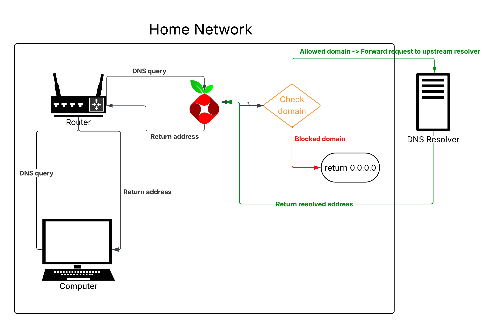

# Overview

In the digital age, data gathering, tracking, and ads are massive revenue streams for corporate giants. Roughly ~75% of Google’s revenue and ~98% of Meta’s revenue come from advertising, so it’s no surprise that the modern web is packed with trackers and junk we never asked for.

For people who value privacy and cleaner pages, tools like Pi-hole (and the uBlock Origin browser extension, though that’s outside the scope of this project) can make a huge difference. Pi-hole is a DNS-based filtering tool, designed for Linux systems, that’s primarily used as a network-wide ad and tracker blocker.

In this repo, I document my process of setting up and configuring a Raspberry Pi Zero 2 W to use Pi-hole to block ads for devices on my network.

The goal is to end up with a low-power Raspberry Pi acting as a dedicated DNS sinkhole for my home network, giving me network-wide ad blocking while I learn more about DNS, Linux, and basic homelab/network setup.

# How it works

### DNS
Domain Name System (DNS) is the service that translates human-readable domain names like `www.example.com` into IP addresses that computers use to talk to each other.

When a user types a website into a browser, their device sends a DNS query (typically through a router) to a DNS resolver. This resolver is usually run by the user’s Internet Service Provider (ISP) or by a public DNS provider such as Cloudflare or Google.

The resolver looks up the IP address for that domain (using its own cache or by querying other DNS servers on the internet), then sends the answer back. The router passes that response to the user’s device, and the browser then knows which IP address to connect to in order to load the website.

### Ads
When a user visits a website that includes ads or tracking scripts, the browser does not only resolve the main site’s domain. It also issues additional DNS queries for third-party domains that serve ads, analytics, and other embedded content. Because these domains must still be resolved through DNS, Pi-hole can be used to identify and block many of these requests, stopping the unwanted content from loading.

### Pi-hole
Pi-hole is a DNS sinkhole that protects devices from unwanted content. A DNS sinkhole acts as a DNS server that checks each requested domain against blocklists (and optionally allowlists). If the domain is allowed, Pi-hole forwards the query to an upstream DNS resolver and returns the resulting IP address to the client. If the domain is blocked, Pi-hole instead returns the non-routable address `0.0.0.0`, effectively preventing the connection.

### Diagram

The diagram illustrates how DNS queries from a client in a home network are processed by Pi-hole and an upstream DNS resolver, including how blocked domains are returned as `0.0.0.0`.

# Setup
### What I used: 
- Raspberry Pi Zero 2 W
- Pi-hole
- Micro SD (for operating system)
- Micro SD reader (for writing operating system to micro SD)
- Micro USB (for powering the Pi)
- Computer (to write operating system to micro SD)

### Steps:
1) Download [Raspberry Pi Imager](https://www.raspberrypi.com/software/)
2) Plug in microSD card to computer and run Raspberry Pi Imager
3) Choose `Raspberry Pi Zero 2 W` for Device, and `Raspberry Pi OS Lite` for OS (the one that says "A port of Debian Bookworm...").
4) Set hostname to something simple like "pihole", create a Pi account, enter network info, and enable SSH w/ password auth.
5) Finish installing the OS onto the microSD, insert the microSD into the Pi, and connect the Pi to a power supply.
6) Give the Pi a minute or so to finish booting, then open up cmd on your computer and type: `ssh [username]@[hostname].local` and enter the password. This allows us to SSH into the Raspberry Pi Zero 2 W and install Pi-hole.
7) Go to [Pi-hole documentation](https://docs.pi-hole.net/main/basic-install/), copy the One-Step Automated Install command `curl -sSL https://install.pi-hole.net | bash`, paste into your terminal, and run, following the prompts to finish.
8) Set a static IP for Pi-hole so devices always know where to reach it.
9) I recommend Google or Cloudflare for upstream DNS resolvers.
10) Query logging allows you to see all queries. Choosing yes here allows you to see which ad domains were blocked.
11) I chose the show everything option for more comprehensive logs.
12) Note the Pi-hole's static IP and web login
13) Go check out the web GUI at `https://[Pi-hole_static_IP]/admin`

# Acknowledgements
- [WesOps](https://www.youtube.com/watch?v=d_3h5n9mPdI) on YouTube. His video was what introduced me to Pi-hole and inspired me to give this a try.
- [Pi-hole](https://pi-hole.net/)
