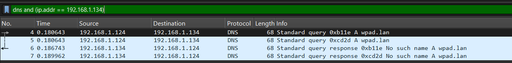
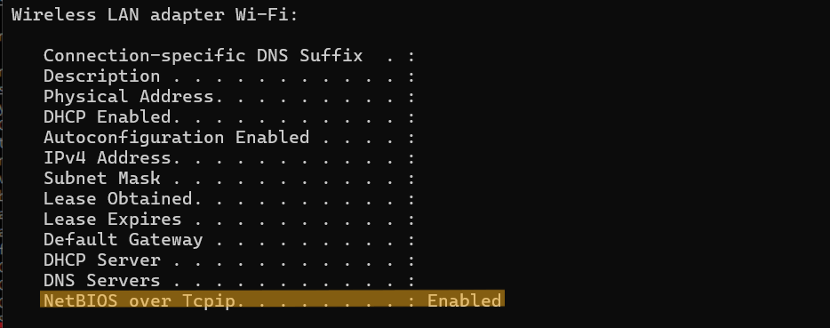
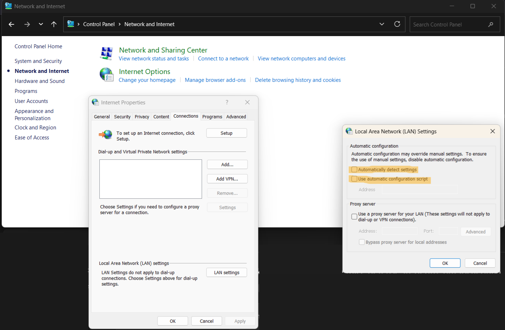

# Description
This file serves as documentation of my use of Wireshark to analyze and understand my DNS traffic and Pi-hole in action.

### Web Proxy Auto-Discovery (WPAD)
Upon opening my Wireshark and capturing from Wi-Fi, I was faced with a bunch of existing queries, leaving me clueless on where to start. So, I restarted the capture and noticed that I had a repeating set of DNS queries for `wpad.lan`. 

Now, what is `wpad.lan`, and why is it being queried so often? Surely it's something important, perhaps related to security or updates? 

Nope, WPAD stands for [Web Proxy Auto-Discovery](https://en.wikipedia.org/wiki/Web_Proxy_Auto-Discovery_Protocol), a protocol "used to ensure all systems in an organization use the same web proxy configuration. Instead of individually modifying configurations on each device connected to a network, WPAD locates a proxy configuration file and applies the configuration automatically" (Source: [CISA.gov](https://www.cisa.gov/news-events/alerts/2016/05/23/wpad-name-collision-vulnerability)). 

In typical implementations, WPAD can try to obtain the file via DHCP, then DNS (which is how I discovered this on Wireshark), and finally Link-Local Multicast Name Resolution (LLMNR)/NetBIOS.

I already know WPAD is enabled and is performing the DNS step thanks to Wireshark. I wanted to see if it was also using DHCP and LLMNR/NetBIOS as existing documentation suggests.

So, I filtered for DHCP packets to verify this and found that in fact, the `Option (55) Parameter Request List` includes item `(252) Private/Proxy autodiscovery` which tells the DHCP server: "If you support option 252 (WPAD URL), please send it to me". 

I then filtered for LLMNR and NetBIOS but found no packets. However, during my research on these protocols, I learned that they make my machine vulnerable when connected to a public/insecure network. As a result, I decided to check if I have these protocols enabled on my device, and if so, to disable them.

To do this, I asked ChatGPT how to test if I have LLMNR enabled, and it told me to ping a nonexistent hostname while capturing on Wireshark with an `llmnr` filter. If I see LLMNR packets, then I have it enabled. Evidently, I have LLMNR enabled. Wireshark capture resulting from ping command: `ping lanwqdwd1n`:

As for NetBIOS, I found a [blog post](https://blog.alexmags.com/posts/disable-netbios) that showed how to check if it is enabled.

Having WPAD, LLMNR, and NetBIOS enabled is not ideal if you use your machine on public networks. These protocols have well-known, long-standing weaknesses that can be abused for man-in-the-middle (MITM) attacks (For example, see [SentinelOne](https://www.sentinelone.com/blog/in-the-wild-wpad-attack-how-threat-actors-abused-flawed-protocol-for-years/)). 

The general flow goes like this: 
1) A client/victim sends a name-resolution or auto-discovery request that any host on the local network is allowed to answer.
2) An attacker on the same network impersonates the legitimate responder and, from there, can redirect traffic and/or perform MITM.

On a secured private/home network with only trusted devices, the risk is much lower, and these protocols will usually “just work” without obvious issues. However, on public or untrusted Wi-Fi (airports, cafés, hotels, etc.), you have no control over who is on the same network, which makes these weaknesses very attractive to attackers. Because I use a laptop that may connect to public Wi-Fi, I’ve chosen to disable WPAD, LLMNR, and NetBIOS. It’s good hardening practice, and I don’t rely on any legacy services that require them.

**Disabling WPAD:**
1) Open Control Panel -> Navigate to Network and Internet.
3) Click Internet Options -> Lan Settings -> Uncheck "Automatically detect settings".

**Disabling LLMNR:**
1) Press Win + R, type `regedit`, press enter.
2) Navigate to `HKEY_LOCAL_MACHINE\SOFTWARE\Policies\Microsoft\Windows NT`.
3) Find a folder/key named `DNSClient` under `Windows NT`. Create it if it does not exist.
4) In `DNSClient`, Right-click → New → DWORD (32-bit) Value.
5) Name it `EnableMulticast`.
6) Set `Value data` to `0`, (0 == LLMNR disabled).
7) Reboot adapter to ensure setting takes effect.

Ping an invalid hostname again, while capturing with Wireshark to verify LLMNR is disabled.

No LLMNR packets were detected.

**Disabling NetBIOS:**
1) Press Win + R, type `ncpa.cpl`, press enter.
2) Right click the active adapter (in my case it is Wi-Fi), click on Properties.
3) Select Internet Protocol Version 4 (TCP/IPv4), click on Properties.
4) In the IPv4 window, click Advanced.
5) Go to the WINS tab.
6) Under NetBIOS setting, select "Disable NetBIOS over TCP/IP".

Run `ipconfig /all` again to verify NetBIOS has been disabled.

Using Wireshark to capture DNS traffic again, I no longer see DNS queries for `wpad.lan`, confirming that WPAD auto-detection has been disabled.

---
